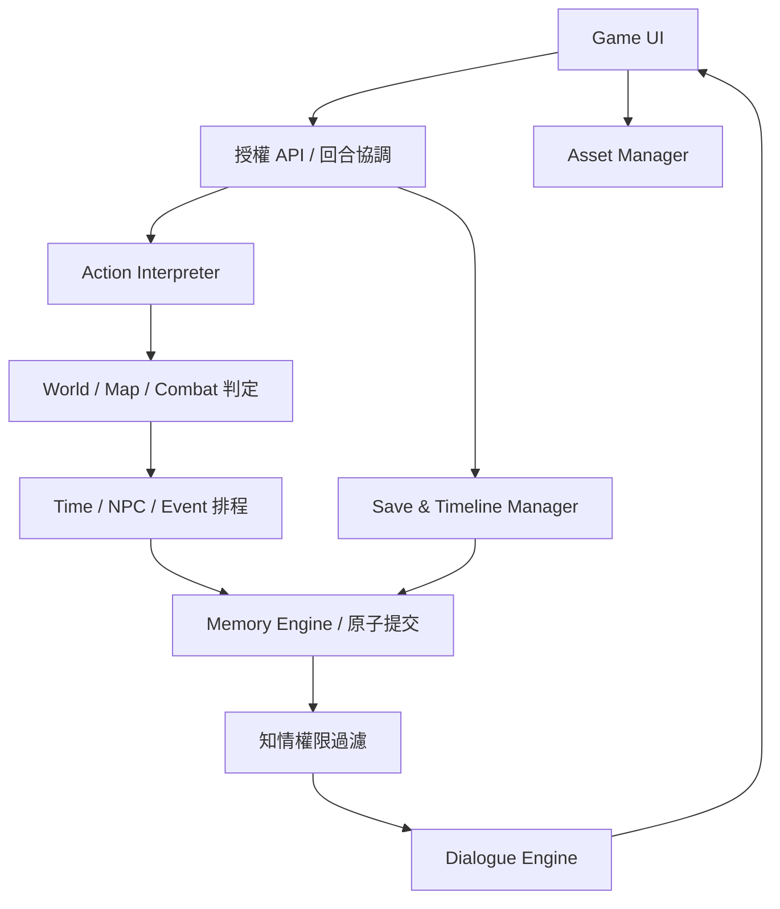

# 《問道九州》AI Living World — 技術架構 v0.1

本專案是開發起點，不是完整生成式遊戲。已交付可操作的持久化引擎與遊戲畫面；AI、完整戰鬥與高階世界模擬仍待實作。以下明確區分目前程式與目標架構。

## 1. 技術選型與部署

- 客戶端：React 19、TypeScript、SVG 場景與拓撲地圖；瀏覽器可在桌面與行動裝置使用。後續以 Capacitor / Tauri 包裝，原生包裝尚未交付。
- API：Vinext + Cloudflare Workers，正式資料保存在 D1（SQLite）。Sites 保護登入，所有查詢都以伺服器取得的 userId 授權，客戶端不可指定 owner。
- 引擎：無 UI / 模型依賴的 JavaScript 模組 `lib/game/engine.mjs`，可用 Node 測試。這一版模組函式仍集中在單一核心檔，下一步按介面拆分。
- 正式狀態目前採一世界線一個 JSON 聚合，單 SQL CAS 更新：`UPDATE worlds SET state=?,revision=? WHERE id=? AND owner=? AND revision=?`。事件與回合 receipt 在同一聚合內，無部分扣款或部分取得物品。讀取競爭者收到 409 後重新載入。
- 這種聚合適合原型，**不是大型世界最終資料模型**。資料量與序列化成本會隨歷史線性增加；尚未宣稱百萬事件效能。正式擴充前遷移到下節索引表與提交批次。
- 下一階段模型轉接器在伺服器呼叫；金鑰不進入客戶端。未配置模型時只啟用規則式回應，未知行動不假裝被解析成功。
- 向量索引：先 SQLite FTS5 / 可部署的全文索引 + 外部向量服務；大量資料可遷移 PostgreSQL + pgvector。不能靠向量判定客觀事實；向量候選查到後還須重新從正式資料驗證权限和版本。D1 是否提供所需 FTS 擴充須於接入時驗證，不把未驗證能力當已配置。

## 2. 模組依賴



目標模組介面：

|模組|輸入|輸出|正式寫入權限|
|---|---|---|---|
|Action Interpreter|玩家文字、已知地名、命令規格|ActionProposal|無|
|World Simulation|正式狀態、驗證行動、規則版本|Resolution / effects|僅協調器提交|
|Memory Engine|worldId、actorId、query|授權記憶、證據與事實|事件提交專用|
|NPC Agent|人格、自身認知、目標、可用資源|有限成本的行動提案|無|
|Event Engine|預建真相、期限、前置狀態|可觸發事件、證據披露|協調器驗證|
|Time Engine|起止時間、排程、玩家計畫|停點、狀態差異、可見報告|協調器驗證|
|Map Engine|位置、出入口、能力、時間|合法路徑、耗時、到達事件|無|
|Combat / Progression|狀態、戰術、規則、亂數|可重播判定結果|無|
|Save / Timeline|父存檔、共享版本、owner|快照、分支 ID|授權交易|
|Dialogue|已提交事件、說話者可見上下文|台詞及描寫|無|
|Assets|地點/角色視覺設定與素材索引|可重用 assetId|素材庫專用|

## 3. 資料模型與七層記憶

完整下一階段 DDL 見 `target-schema.sql`；此檔是**設計稿，未套用正式資料庫**。已套用的 migration 僅建立 worlds、saves，實際欄位見 `db/schema.ts`。

|層|設計實體|目前對應|
|---|---|---|
|L1 遊戲規則|rule_packs / rule_versions|引擎驗證程式、version=1|
|L2 世界設定|world_templates / locations / edges / factions / ability_rules|PLACES、EDGES 與入門規則|
|L3 NPC 原生記憶|npc_templates / visual_profiles|NPCS 常數；外貌未製作|
|L4 世界線狀態|timelines / entity_states / resources / scheduled_jobs|worlds.state 聚合|
|L5 主角記憶|knowledge_claims / inventory / injuries / commitments|player、events.knowers、promises（尚無承諾操作）|
|L6 事件與情節|events / event_entities / event_links / truths / evidence|events、truth；真相不傳給客戶端|
|L7 NPC 認知|knowledge_claims / knowledge_sources / relationships|events.knowers、beliefs；誤解更新未接入|

每個事件記錄 id、世界線、世界時間、記錄時間、參與者、地點、內容、来源、確認狀態、知情者、effects、links。時間以世界內整數分鐘記錄，與 UTC 寫入時間分離。現在真相在 state 中由程式建立，玩家行動不能覆寫；後續在 truths 中以 seal hash、不可變觸發器與資料庫權限封存。

認知模型必須區別：客觀事件（真）、某人相信的主張（可能假）、資訊來源、可信度與信心。資訊傳播須生成一條有 sender / receiver / channel / time 的 transmission；只有接收者認知改變，不修改事件。

NPC 模板固定的是初始人格、來源背景與行為界限；境界、能力、關係、情緒必須存在世界線狀態，不把可成長的境界永久寫死在模板。原型僅顯示模板境界與獨立進度，尚無境界突破，需在下一次 schema 升級移出。

每條重要關係包含 trust / respect / closeness / caution / aligned interests / dependence，加上恩怨事件與未解決衝突引用，方向 A→B 與 B→A 分開。原型僅顯示前四個靜態初值，未自動改變關係。

所有可變表以 `(timeline_id, entity_id)` 隔離；模板透過 immutable version 引用。新世界線克隆模板種子，不克隆上一條世界線經歷。分支可繼承父快照之前的歷史，禁止讀父快照之後的事件。原型完整拷貝快照，未實作 copy-on-write。

## 4. 一回合與錯誤處理

1. 以登入身份查找 owner/world，解析 requestId 與 expectedRevision。
2. 若 requestId 已提交，返回原回合 receipt，不重新扣除資源。
3. 讀取正式狀態、場景、角色、規則、相關記憶；解析行動。
4. 引擎驗證能力、位置、資源、合法性；固定亂數種子 / 檢定記錄（原型尚無隨機判定）。
5. 在獨立副本結算，構造完整事件與 effects，禁止直接寫正式物件。
6. 驗證不變條件後，CAS 交易提交狀態、事件、receipt。零列更新即衝突，不追加部分事件。
7. 生成 actor-specific 可見視圖；敘事模型只能讀該視圖，不能讀整個 GM 聚合。
8. 模型失敗不回滾已提交事實；保留結果顯示規則式描述，敘事重试不再結算行動。

目前事件與狀態為一條 SQLite UPDATE，因此具有資料庫原子性。正式拆表後須採 D1 transactional batch 或經驗證的交易機制：提交表 requestId 唯一鍵、revision 條件守衛、events、effects、outbox 同批完成；不能只把幾次 await INSERT 當作交易。

若網路在提交後斷線，前端保留相同 requestId 的重試按鈕。版本衝突可重新載入。手動存檔是不可變快照；載入歷史建立新分支，避免覆盖現在世界線。

## 5. 混合檢索

權限过滤一定在檢索之前，不能檢索全部秘密後要求模型「不要洩漏」。

- 必取：場景、角色狀態、原生人格、當前事件、未履行承諾、衝突和涉及的資源事實。
- 精確：worldId / actorId / eventId / participant / location / source。
- 圖譜：人物共同事件、因果、證據、承諾與披露鏈。
- 語意：僅對 actor 可見候選索引查詢；最终與正式紀錄合併去重。
- 排序：重要性 + 語意 + 關係相關度 + 近期性；規則、未解決承諾與關鍵經歷保留固定預算，不能被近期閒聊擠掉。
- 顯示摘要僅作衍生讀模型，附原事件 ID。摘要错误可重建，不改原歷史。

目前 retrieve 以知情者精確过滤、角色相關度、入門/承諾優先權與時間排序，保留 30 項；簡單字元重疊只作暫時相關度。尚無向量、圖譜及完整語意品質測試。

## 6. AI JSON 協定（目標）

```json
{
  "protocolVersion": 1,
  "requestId": "uuid",
  "timelineId": "uuid",
  "expectedRevision": 18,
  "proposal": {
    "kind": "move",
    "actorId": "player",
    "targetId": "qifeng.courtyard",
    "spokenText": null,
    "intent": "詢問師父能否下山",
    "durationMinutes": 65
  },
  "evidenceRefs": ["event-id"],
  "needsPlayerDecision": false
}
```

模型只提案，不准輸出 SQL、替換 save、宣告成功、直接設定 HP/金錢、修正真相或指派知情者。protocolVersion、欄位白名單、長度、範圍、entityId、角色控制權與信息來源由伺服器 schema 驗證。多步提案最多 8 步，遇重大決策停止。玩家說「偷偷跟蹤」僅成為跟蹤嘗試，由引擎判定。

結果協定包含 committedRevision、eventIds、checks、visibleEffects、elapsedTime、interruptReason、narrationContext。narrationContext 為當下 NPC / 玩家各自已知事實的投影，不是共用全知 prompt。對話文字不得創造新物品、到場人物或傷勢消失；重要事實以結構欄位生成，衝突重生成或回退模板。無法保證任意 prose 自動完美驗證，因此需觀測與人工回歸集。

本原型 API：`GET /api/game` 列表；`POST` 支援 new / load / turn / save / branch / restore。turn 帶 world、revision、requestId、text 或 action。目前 action types 為 move / train / consume / enroll / wait / speech。

## 7. 世界模擬與快進

目標：min-heap 取下個 due job，跳到 min(targetTime,jobTime,playerInterruptTime)，按 elapsed delta 結算持續狀態，再依 `(time,priority,sequence)` 執行確定排序事件。世界時間不按每個居民逐分鐘迭代。

- 近場高精度：完整感知、個人行動、可能逐招判定。
- 中場：正在執行目標的 NPC，以前置條件和剩餘工作量更新。
- 遠場：市場、人口、勢力以聚合模型更新；重大個體死亡仍保留事件。
- 事件不可因距玩家遠就停止。精度切換不能改寫已經結算的結果。
- 玩家訓練按功法、環境、資源、身體條件累積；突破有前置條件，不單靠時間跨境。
- 干預停點只由已排事件與玩家影響規則決定，不每次快進隨機強塞劇情。
- 報告提供親歷、收訊、傳聞；隱藏事件只留 GM 記錄，不能列「尚未得知某某死亡」洩漏內容。

原型以早晚作息、NPC 到達時間、已排通知與 targetTime 的最小值推進，月例按跨越月數累計，修煉與傷勢依 elapsed delta 更新。第一個第 8 日召集通知會中斷；不生成戰爭或意外。三年測試檢查 36 次月例與進度，**不是完整三年社會模擬驗收**。

地圖使用不可變地點 ID 和 Dijkstra 道路圖。NPC 切換到在途狀態後，不會同時出現在出發點與終點；到達時間依道路耗時。玩家原型移動為一項原子旅程，若快進被打斷則仍留出發點；未做逐段旅途與中途位置。

## 8. 2D 介面與素材

左側導航：場景、輿圖、記憶、人物、世界線、開發檔。場景中央顯示程式繪製的山門背景和可見 NPC；下方為已提交敘事與自由輸入。右側為正式 player state、背包、時間快進與已知事件。

地圖點擊→提交 move→伺服器最短路徑與時間結算→收到新 state→更新場景、日期、在場 NPC。未探索地點須由 known 集合控制；原型把六個宗門公開地點設為已知，不含秘密地點。

角色視覺設定表應固定年齡、髮色、服裝、眼睛與特徵，引用 reference asset。Asset Manager 查 `(characterId,pose,expression,styleVersion)`，不存在才排程生成。圖片不能改地圖或 NPC 實際位置。目前只有 SVG 背景、字徽占位，清楚標示立繪待製作。地理 topology 是資料來源，插畫只負責呈現。

## 9. 事件真相固定

重大事件於第一條線索曝光之前進行完整建構：原因、人物/動機、能力/資源、時間線、機制、證據與假線索來源、各勢力認知、無干預走向、可改變節點與合理結局。封存時記 hash 和規則版本。若配置缺項，拒絕發布線索。後續可更新 future plan / actual outcome，不能修改 sealed past。

原型帶一個不對外披露的固定庫房事件種子，用於防改寫測試；**尚未完成完整真相模板校驗、調查玩法與證據披露**。

## 10. 分階段實作順序

|階段|交付|退出條件|
|---|---|---|
|0 已交付|原型引擎、D1、操作 UI、12 個引擎回歸測試|編譯成功、核心測試過關；瀏覽器實測另列限制|
|1 記憶正規化|target schema、event/effects、knowledge graph、migration、索引|100/1000 回合，秘密不洩漏，CAS 競態、斷網注入、匯入驗證測試|
|2 自由互動|模型轉接、結構提案、未知行動、NPC 說話者視圖、敘事重試|玩家任意可行動作可解析；非法效果拒絕；無重大決策代替玩家|
|3 NPC 與因果|承諾、多維關係、訊息傳播、目標規劃、真相封存|無干預事件照常完成；NPC 目標與認知一致|
|4 時間與修行|優先佇列、跨年経濟、成長條件、戰鬥、傷病、死亡|三年基準資料可重播、期限與停點精確、全存檔回復|
|5 2D 與交付|角色參考圖、差分、分層地圖、原生包裝|資產重用、行動端適配、跨裝置與匯出匯入驗證|

不以固定開發天數保證模型品質；各階段先取得退出條件再擴充。

## 11. 執行與測試

`node --test tests/engine.test.mjs`：12 個引擎情境測試。`python3 tests/database_test.py`：SQLite migration、CAS 競爭與快照持久化。`pnpm run db:generate` 在 schema 改變後執行。`node <sites-plugin>/scripts/build-site.mjs` 建立 Worker 與客戶端。

目前測試涵蓋記憶保留、知情隔離、三年簡化成長、物品與冪等、傷勢、人格、世界線、真相、旅程、失敗不變更、快照與自然語言。未知自由行動測試只驗證透明記錄，不等同完整 AI 推理通過驗收。還欠真實模型、故障網路、正式 D1 競態壓測、跨裝置與瀏覽器視覺測試。

## 12. v0.2 — 3D 空間原型

新增 Three.js 客戶端 `components/game/World3D.tsx`，帶簡單幾何人物、行走/待機動畫、跟隨鏡頭、WASD / 方向鍵 / 地面点击 / 螢幕方向按鈕。每次移動先提交伺服器正式座標，畫面再插值到已提交位置；目前是每步交易，尚未實作連續即時網路同步、尋路導航網格或骨骼角色動畫。

`spatial.mjs` 定義可通行邊界、建築碰撞、距離、NPC 場景座標與規則生成器；walk 驗證每步距離與路線穿牆，耗時與座標一起提交。NPC 日常場景座標沿簡單巡行軌跡隨世界分鐘更新；早晚跨場景旅行仍使用道路耗時。世界自行運轉開關只在這個場景開啟期間每 20 秒提交 1 分鐘，關閉頁面後**不會以真實時鐘離線跑世界**。快進則照常結算。

`explore` 在棲風峰庭院建立一處東側區域與一位外門弟子。生成結果含名稱、地理父節點、道路、terrainSeed、人格、背景、目標與初始狀態，直接持久化，不在每次渲染重建；現在是四組規則種子與一個可重用場景模板，不是 AI 生成任意 3D 建築或無限世界。地圖節點与連接為實際世界資料，3D 模板顏色與樹木配置按 seed 變化。

生成角色清晨去採藥區、傍晚回庭院；初次交談寫入介紹記憶。直接對指定 NPC 發言需要同場景、非在途且相距 12 公尺內。玩家附近其他人物可能聽見發言；這仍是簡化聲音範圍模型，尚未加隔牆與耳力規則。

v1 舊狀態在下一回合補上 position / generatedPlaces / generatedNPCs / generatedEdges，版本升為 2；舊快照保持原樣，恢復分支後也走相同升級路徑。純引擎測試增至 19 項，另有 4 個 SQLite 測試。

## 13. v0.3 — 等角像素方向

正式場景改為 `IsoWorld.tsx` + `isometric.mjs` 的 Canvas2D 原創像素繪製。參考等角生活遊戲的視角與氛圍，未使用 Witchbrook 的圖片、精靈或地圖。保留原先場景座標、碰撞、NPC 作息、新區域規則生成、存檔 API，不讓美術改動正式資料。Three.js 原型元件保留在來源中但不再載入玩家頁面。

角色精靈、屋舍、石路、竹木、茶桌、晾曬架與庭園按深度排序繪製；行走/待機與飄葉為呈現層動畫，NPC 位移仍根據世界時間與正式位置。畫面朝向的方向鍵先映射為等角世界方向，點擊用投影逆變換，再送伺服器碰撞驗證。夜色依据世界时间生成，不以動畫時間代替遊戲時間。

場景占據主區域，洛河狀態收進可展開面板，日期、出口、對話與快進仍可操作。此版使用共用庭院模板與初步像素素材，尚未完成各區域獨立美術、角色四方向精靈、四季素材、可進入建築或完整環境碰撞；不宣稱已達到商業遊戲美術品質。場景 png 為同一渲染器對引擎實際初始流程狀態的離線視覺檢查，非登入瀏覽器的操作錄影。
